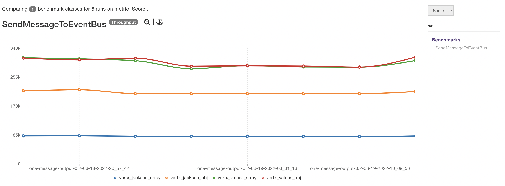

"_Immutability Changes Everything._"
**Pat Helland**


[](https://sonarcloud.io/dashboard?id=imrafaelmerino_vertx-values)
[](https://sonarcloud.io/dashboard?id=imrafaelmerino_vertx-values)
[](https://sonarcloud.io/component_measures/metric/coverage/list?id=imrafaelmerino_vertx-values)
[](https://search.maven.org/artifact/com.github.imrafaelmerino/vertx-json-values/0.3/jar)

- [Goal](#goal)
- [Explanation](#exp)
- [How-to](#howto)
- [Performance](#perf)
- [Requirements](#requirements)
- [Installation](#inst)

## <a name="goal"><a/> Goal
According to Vertx documentation: 

_it’s a convention and common practice in Vertx to 
send messages as JSON. JSON is very easy to create, read and parse in all the languages 
that Vertx supports, so it has become a kind of lingua franca for Vertx._

**The problem is that every time a message of type [JsonObject or JsonArray](https://vertx.io/docs/apidocs/io/vertx/core/json/package-summary.html) 
is sent across the Event Bus, Vertx has to make a copy of the message**. The bigger the JSON, 
the worse the impact on performance. Moreover, it puts a lot of pressure on the Garbage Collector.
**vertx-values solves this by adding support to send the immutable JSON from
[json-values](https://github.com/imrafaelmerino/json-values)**. json-values is a truly 
immutable JSON implemented with persistent data structures with a functional and simple
API to create, validate, generate and manipulate JSON. It's been designed from FP principles.


## <a name="exp"><a/> Explanation

Every type (_Integer_, _String_, _JsonObject_, _JsonArray_, _Buffer_, etc.) that can be sent 
across the Event Bus has an associated [MessageCodec](https://vertx.io/docs/apidocs/io/vertx/core/eventbus/MessageCodec.html). 
A MessageCodec is where it's defined how to serialize 
and deserialize a message. A third method called _transform_ is also 
implemented in this class. When a verticle sends a message locally to the EB, Vertx intercepts 
that message and calls its codecs _transform_ method.

Go to the source package [io.vertx.core.eventbus.impl.codecs](https://vertx.io/docs/apidocs/io/vertx/core/eventbus/impl/codecs/package-frame.html) 
to check out what types Vertx supports. The good thing is that you can define your codecs 
to send messages of new types to the EB.

The default JSONs implemented in Vertx with **Jackson**, [JsonObject](https://vertx.io/docs/apidocs/io/vertx/core/json/JsonObject.html) and 
[JsonArray](https://vertx.io/docs/apidocs/io/vertx/core/json/JsonArray.html), have the codecs [JsonObjectMessageCodec](https://vertx.io/docs/apidocs/io/vertx/core/eventbus/impl/codecs/JsonObjectMessageCodec.html) 
and [JsonArrayMessageCodec](https://vertx.io/docs/apidocs/io/vertx/core/eventbus/impl/codecs/JsonArrayMessageCodec.html). Let's
take a look at their _transform_ method:


```java

// Vertx impl 
public JsonObject transform(JsonObject message) {
    return message.copy();
}

```

Since **Jackson** is not immutable at all, the _transform_ method 
has to make a copy of the message before sending it to the EB. Otherwise, we would have 
a shared reference to an object among independent Verticles, which would be 
a nightmare and violates some of the most basic principles of message-passing 
architectures.

As I pointed out before, making a copy every time a message is sent is inefficient and put more pressure on 
the Garbage Collector, especially if you have a large number of Verticles communicating one to
each other.

vertx-values provides codecs to send [json-values](https://github.com/imrafaelmerino/json-values) across the EB. 
Take a look at the _transform_ method of its codecs:

```java

// vertx-values impl
public JsObj transform(final JsObj message) {
   return message;
}

```

**As you can see, it returns the same message without making any copy**.
And if that was not enough, immutable data structures have a lot of benefits, 
especially in concurrent programs and architectures based on the actor model like Vertx.


## <a name="howto"><a/> How to

To register the codecs from vertx-values is as simple as deploying a Verticle (
in Vertx it could not have been otherwise 😀)

```java  
import vertx.values.codecs.RegisterJsValuesCodecs;

vertx.deployVerticle(new RegisterJsValuesCodecs(), 
                     r -> System.out.println("Registered codecs!")
                    );
                    
```

If you deploy de codecs more than once, you'll receive an error saying they've already been registered.

## <a name="perf"><a/> Performance

Let's define a Verticle named "bounce" that replies with the same message it receives:

``` java

 vertx.eventBus()
      .consumer("bounce", 
                message -> message.reply(message.body())
               )

```

We are going to send two kinds of messages to the bounce Verticle:
- A JSON object: obj
- An JSON array of four objects: [obj, obj, obj, obj]


and wait for the response, comparing the results using the JSON from Vertx and the 
JSON from json-values. Of course, the benchmark has been carried out with
[jmh](https://openjdk.java.net/projects/code-tools/jmh/).

I've run the test 8 different times in my computer (MacBookPro Apple 8 cores M1 16GB LPDDR4)
and uploaded the results to [JMH Visualizer](https://jmh.morethan.io/), 
getting the following chart:





As you can see, no matter if you send an object or an array four times bigger, you
get the same result with vertx-values. Since there is no copy before sending the
messages, it makes sense.

On the other hand, sending the JSON  object from Vertx, the performance goes down around
40%, and it collapses sending the JSON array, which makes sense since copying an object
takes longer the bigger it is.


## <a name="requirements"><a/> Requirements

Java 8 or greater.

## <a name="inst"><a/> Installation

```xml

<dependency>
    <groupId>com.github.imrafaelmerino</groupId>
    <artifactId>vertx-json-values</artifactId>
    <version>0.3</version>
</dependency>

```
